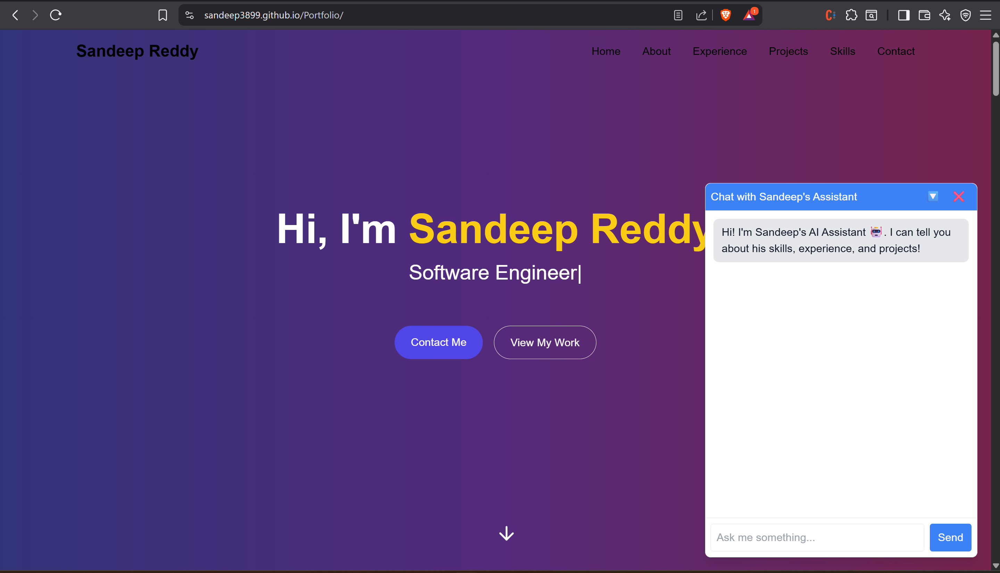

# Personal Portfolio with AI Chatbot

This is a full-stack **Personal Portfolio Website** that showcases Sandeep Reddy Yeruva's professional experience, skills, and projects. It includes an **AI-powered chatbot assistant** that can answer questions about Sandeep, using his resume, portfolio links, and other relevant details.

## 🚀 Features

- 🌟 **Modern Frontend**: Built with React + TypeScript + Tailwind CSS.
- 🤖 **AI Chatbot Integration**: Powered by Groq's `llama-3.1-8b-instant` model to answer questions about Sandeep in third person.
- 📝 **Resume Parsing**: Extracts text from a Google Drive PDF resume dynamically.
- 🔗 **Link Sharing**: Provides direct access to important professional links.
- ⚡ **Fast Backend**: Built with FastAPI for chat handling and context management.
- 🌐 **Deployment**:
  - Frontend deployed on **GitHub Pages**.
  - Backend deployed on **Render**.

---

## 🛠️ Tech Stack

### Frontend

- **React** (TypeScript)
- **Tailwind CSS** for styling
- **Vite** for fast builds and development

### Backend

- **FastAPI** (Python)
- **Groq SDK** for AI integration
- **PyMuPDF (fitz)** for resume parsing
- **dotenv** for environment variable management

### Deployment

- **GitHub Pages** for frontend hosting
- **Render** for backend hosting

---

## 📂 Project Structure

```
Portfolio-main/
├── .gitignore
├── eslint.config.js
├── index.html
├── package-lock.json
├── package.json
├── postcss.config.js
├── requirements.txt
├── tailwind.config.js
├── tsconfig.app.json
├── tsconfig.json
├── tsconfig.node.json
├── vite.config.ts
├── .github/
│   └── workflows/
│       └── deploy.yml
├── Picture/
│   └── Pic.jpg
├── Public/
│   ├── Pic.jpg
│   └── Sandeep_Resume.pdf
├── backend/
│   ├── links.py
│   ├── main.py
│   └── data/
│       └── resume.pdf
└── src/
    ├── App.tsx
    ├── index.css
    ├── main.tsx
    ├── vite-env.d.ts
    └── components/
        ├── About.tsx
        ├── ChatWidget.tsx
        ├── Contact.tsx
        ├── Experience.tsx
        ├── Footer.tsx
        ├── Hero.tsx
        ├── Navbar.tsx
        ├── Projects.tsx
        └── Skills.tsx

```

---

## ⚙️ Setup Instructions

### 1. Clone the Repository

```bash
git clone https://github.com/Sandeep3899/Portfolio.git
cd Portfolio-main
```

### 2. Frontend Setup

```bash
cd Portfolio-main
npm install
npm run dev
```

### 3. Backend Setup

```bash
cd backend
pip install -r requirements.txt
uvicorn main:app --reload --port 8000
```

Make sure you have a `.env` file in the backend folder:

```
GROQ_API_KEY=your_api_key
```

---

## 🔑 Environment Variables

| Variable       | Description             |
| -------------- | ----------------------- |
| `GROQ_API_KEY` | Your API key from Groq. |

---

## 🚀 Deployment

- **Frontend:** Deployed using **GitHub Pages** via workflow in `.github/workflows/`.
- **Backend:** Hosted on **Render** (free tier).

---

## 💡 How It Works

1. The chatbot fetches your resume content from Google Drive.
2. When users ask a question, the backend formats the query with resume data and links.
3. The Groq API provides an AI-generated answer in **third person**, ensuring a professional tone.
4. The response is displayed in a **floating chat widget**.

---

## 🎨 Screenshots



---

## 📌 Future Improvements

- Add analytics to track chatbot usage.
- Improve AI prompt engineering for more accurate answers.
- Add support for uploading updated resumes dynamically.

---

## 👨‍💻 Author

**Sandeep Reddy Yeruva**  
[GitHub](https://github.com/sandeep3899) | [LinkedIn](https://www.linkedin.com/in/sandeep-reddy-yeruva/)

© 2025 Sandeep Reddy Yeruva. All Rights Reserved.

This project is intended for personal use, learning, and portfolio demonstration.  
You are free to view, fork, and use this project for educational purposes, but  
please provide proper credit when reusing or modifying the code.

For commercial use, distribution, or inquiries, please contact me directly.
